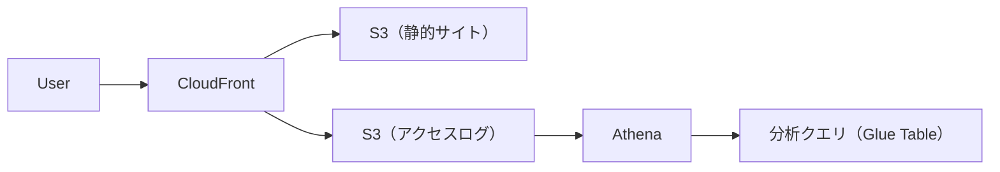
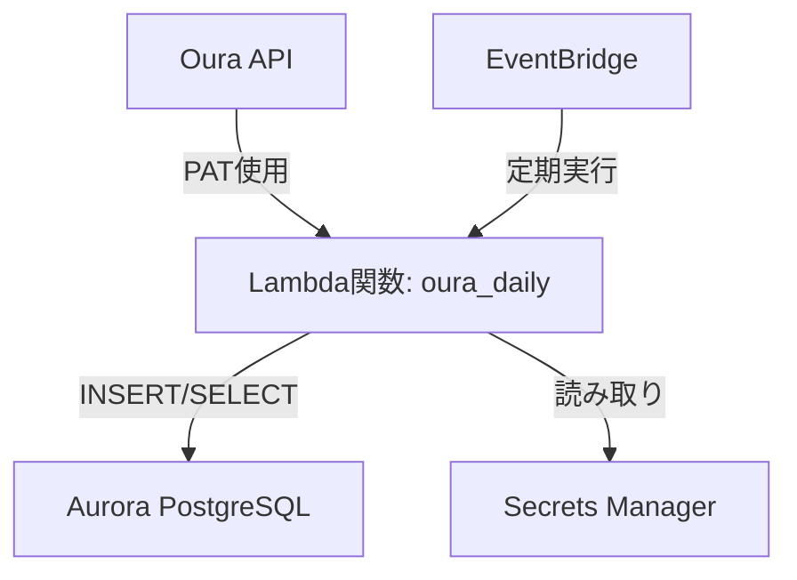

# 設計書

- [設計書](#設計書)
  - [1．システム概要](#1システム概要)
    - [目的](#目的)
    - [対象ユーザー](#対象ユーザー)
    - [構成図](#構成図)
  - [2．使用AWSサービス一覧](#2使用awsサービス一覧)
  - [3．アーキテクチャ設計](#3アーキテクチャ設計)
  - [4．セキュリティ設定](#4セキュリティ設定)
  - [5．今後の拡張案](#5今後の拡張案)

## 1．システム概要

### 目的

AWS S3 + CloudFront を用いた静的Webサイトの構築、およびAthenaによるアクセスログ分析の仕組みを実装し、運用可能な構成を検証する。

### 対象ユーザー

サイト閲覧者（パブリック）、運用者（自分）

### 構成図

## 2．使用AWSサービス一覧

| サービス名      | 用途                                |
| --------------- | ----------------------------------- |
| S3              | 静的Webサイトホスティング、ログ保存 |
| CloudFront      | コンテンツ配信とキャッシュ          |
| Athena          | S3アクセスログのクエリ              |
| IAM             | アクセス制御（バケット・Athena等）  |

## 3．アーキテクチャ設計

- S3静的ホスティングバケット：
  - index.html、404.html
  - パブリック公開 or CloudFrontからのみアクセス可能に制限

- CloudFront設定：
  - S3オリジン、OAI利用
  - アクセスログ有効化 → 別のS3バケットに保存

- Athena用S3ログバケット：
  - CloudFrontログを集約
  - Glue Crawlerで定期的にテーブル更新

- Athena設定：
  - クエリ例：日別PV/訪問者数、特定ページのアクセスランキングなど

## 4．セキュリティ設定

- S3バケットポリシー
- CloudFrontのOAI設定
- IAM Role設計（Athena実行用）

## 5．今後の拡張案

- QuickSight連携による可視化
- IP制限などのセキュリティ強化
- Lambdaでバッチ処理追加（集計や通知）
